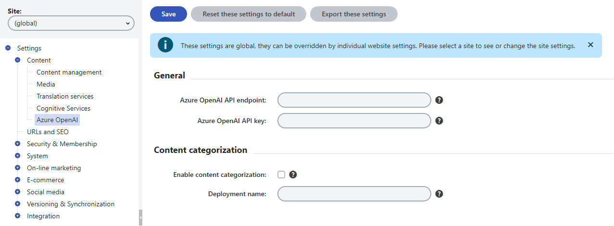
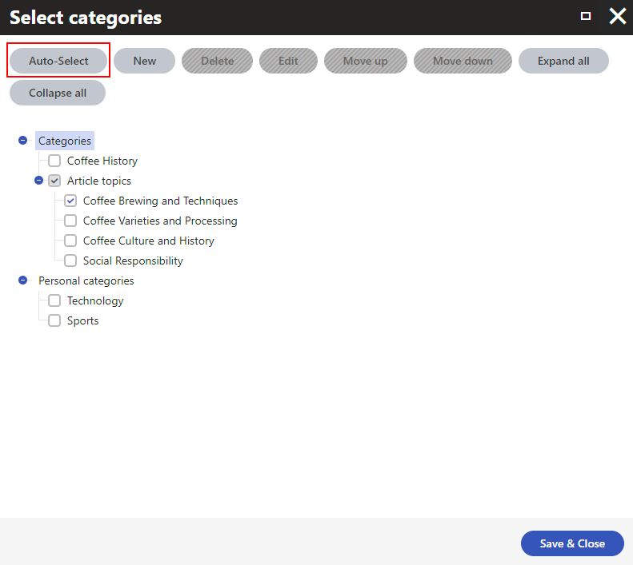

# Xperience Azure OpenAI integration

[![7-day bug-fix policy](https://img.shields.io/badge/-7--days_bug--fixing_policy-grey?labelColor=orange&logo=data:image/svg+xml;base64,PHN2ZyBjbGFzcz0ic3ZnLWljb24iIHN0eWxlPSJ3aWR0aDogMWVtOyBoZWlnaHQ6IDFlbTt2ZXJ0aWNhbC1hbGlnbjogbWlkZGxlO2ZpbGw6IGN1cnJlbnRDb2xvcjtvdmVyZmxvdzogaGlkZGVuOyIgdmlld0JveD0iMCAwIDEwMjQgMTAyNCIgdmVyc2lvbj0iMS4xIiB4bWxucz0iaHR0cDovL3d3dy53My5vcmcvMjAwMC9zdmciPjxwYXRoIGQ9Ik04ODguNDkgMjIyLjY4NnYtMzEuNTRsLTY1LjY3Mi0wLjk1NWgtMC4yMDVhNDY1LjcxNSA0NjUuNzE1IDAgMCAxLTE0NC4zMTUtMzEuMzM0Yy03Ny4wMDUtMzEuMTk4LTEyNi4yOTQtNjYuNzY1LTEyNi43MDMtNjcuMTA3bC0zOS44LTI4LjY3Mi0zOS4xODUgMjguNDY4Yy0yLjA0OCAxLjUwMS00OS45MDMgMzYuMDQ0LTEyNi45MDggNjcuMzFhNDQ3LjQyIDQ0Ny40MiAwIDAgMS0xNDQuNTIgMzEuMzM1bC02NS44NzcgMC45NTZ2Mzc4Ljg4YzAgODcuMDQgNDkuODM0IDE4NC42NjEgMTM3LjAxIDI2Ny44MSAzNy41NDcgMzUuODQgNzkuMjU4IDY2LjM1NSAxMjAuODMzIDg4LjIgNDMuMjggMjIuNzMzIDg0LjI0IDM0LjYxMiAxMTguODUyIDM0LjYxMiAzNC40MDYgMCA3NS43NzYtMTIuMTUyIDExOS42MDMtMzUuMTU4YTU0Ny45NzcgNTQ3Ljk3NyAwIDAgMCAxMjAuMDEzLTg3LjY1NCA1MTUuMjA5IDUxNS4yMDkgMCAwIDAgOTYuMTg4LTEyMi44OGMyNy4xMDItNDkuNTYyIDQwLjgyMy05OC4zMDQgNDAuODIzLTE0NC45OTlsLTAuMTM2LTM0Ny4yMDR6TTUxMC4wOSAxNDMuNDI4bDEuNzA2LTEuMzY1IDEuNzc1IDEuMzY1YzUuODAzIDQuMTY1IDU5LjUyOSA0MS44NDggMTQwLjM1NiA3NC43NTIgNzkuMTkgMzIuMDg2IDE1My42IDM1LjYzNSAxNjcuNjYzIDM2LjA0NWwyLjU5NCAwLjA2OCAwLjIwNSAzMTUuNzM0YzAuMTM3IDY5LjQ5NS00Mi41OTggMTUwLjE4Ni0xMTcuMDc3IDIyMS40NTdDNjQxLjU3IDg1NC4yODkgNTYzLjEzIDg5Ni40NzggNTEyIDg5Ni40NzhjLTIzLjY4OSAwLTU1LjU3LTkuODk5LTg5LjcwMi0yNy43ODVhNDc4LjgyMiA0NzguODIyIDAgMCAxLTEwNS42MDktNzcuMjc4QzI0Mi4yMSA3MjAuMjEzIDE5OS40NzUgNjM5LjUyMiAxOTkuNDc1IDU2OS44OVYyNTQuMjI1bDIuNzMtMC4xMzZjMy4yNzggMCA4Mi42MDQtMS41MDIgMTY3LjY2NC0zNS45NzdhNzM5Ljk0MiA3MzkuOTQyIDAgMCAwIDE0MC4yMi03NC42MTV2LTAuMDY5eiIgIC8+PHBhdGggZD0iTTcxMy4zMTggMzY4LjY0YTMyLjIyMiAzMi4yMjIgMCAwIDAtNDUuMzI5IDBMNDQ5LjE5NSA1ODcuNDM1bC05My4xODQtOTMuMTE2YTMyLjIyMiAzMi4yMjIgMCAwIDAtNDUuMzMgMCAzMi4yMjIgMzIuMjIyIDAgMCAwIDAgNDUuMjZsMTE1Ljg1IDExNS44NWEzMi4yOSAzMi4yOSAwIDAgMCA0NS4zMjggMEw3MTMuMzIgNDEzLjlhMzIuMjIyIDMyLjIyMiAwIDAgMCAwLTQ1LjMzeiIgIC8+PC9zdmc+)](https://github.com/Kentico/.github/blob/main/SUPPORT.md#full-support)  

This custom module allows Kentico Xperience 13 users to [automatically select](https://docs.kentico.com/x/IgqRBg) the best fitting categories for a page based on its content using [Azure OpenAI](https://azure.microsoft.com/en-us/products/ai-services/openai-service).

## Compatibility

The integration is usable with Kentico Xperience 13 **hotfix 13.0.142** or newer.

## Installation

1. Install the [Kentico.Xperience.OpenAI.Azure.KX13](https://www.nuget.org/packages/Kentico.Xperience.OpenAI.Azure.KX13) NuGet package in the administration project.
    - if you encounter an error saying:

        `Unable to resolve dependency 'Azure.AI.OpenAI'. Source(s) used: 'nuget.org'.` during installation, opt for a console installation through **Package Manager Console** (*Tools* → *NuGet Package Manager* → *Package Manager Console* in Visual Studio) and install the package with the **-IncludePrerelease** flag like so:
        
        `Install-Package Kentico.Xperience.OpenAI.Azure.KX13 -IncludePrerelease`
2. Sign in to your [Azure portal](https://portal.azure.com/).
3. Create and configure an [Azure OpenAI resource](https://learn.microsoft.com/en-us/azure/ai-services/openai/how-to/create-resource?pivots=web-portal).
4. [Deploy a model](https://learn.microsoft.com/en-us/azure/ai-services/openai/how-to/create-resource?pivots=web-portal#deploy-a-model).
5. In Xperience, go to **Settings -> Content -> Azure OpenAI** and configure the settings:
    - General:
        - **Azure OpenAI API endpoint:** – value of the **Endpoint** field from **Resource Management -> Keys and Endpoints** of your Azure OpenAI resource in Azure portal.
        - **Azure OpenAI API key:** – value of either the **KEY 1** or **KEY 2** fields (both keys will work) from **Resource Management -> Keys and Endpoints** of your Azure OpenAI resource in Azure portal.
    - Content categorization:
        - Select the **Enable content categorization** option.
        - **Deployment name** – the **Deployment name** you chose when deploying the model. Can be also found in **Azure OpenAI Studio -> Management -> Deployments**.

    

## Automatic selection of categories

After you [set up](#installation) the integration, the next time you assign a page into categories you can simply click the **Auto-Select** button and the best fitting categories based on the page's content get automatically selected.

**Important notes:**
- The automatic selection disregards all preexisting category assignments. Consequently, using the **Auto-Select** on manually categorized pages may suggest a different set of categories for the page. You can always add any desired categories manually on top of the automatic selection.
- The page you are assigning into categories must have at least some data stored in fields with **Text** or **LongText** data types. That is, the automatic selection doesn't work for pages that are built entirely via Page builder.

## Contributing

To see the guidelines for Contributing to Kentico open source software, please see [Kentico's `CONTRIBUTING.md`](https://github.com/Kentico/.github/blob/main/CONTRIBUTING.md) for more information and follow the [Kentico's `CODE_OF_CONDUCT`](https://github.com/Kentico/.github/blob/main/CODE_OF_CONDUCT.md).

## Development environment setup

1. Download/clone this repository.
2. Copy the `/src/CMS/ConnectionStrings.template.config` file to `/src/CMS/ConnectionStrings.config`.
3. Add a directory junction of *src/Kentico.Xperience.OpenAI.Azure/CMSResources/Kentico.Xperience.OpenAI.Azure* into *src/CMS/CMSResources* using Command Prompt **(not PowerShell)**:

    `mklink /J .\src\CMS\CMSResources\Kentico.Xperience.OpenAI.Azure .\src\Kentico.Xperience.OpenAI.Azure\CMSResources\Kentico.Xperience.OpenAI.Azure`
4. Open `/src/WebApp.sln`.
5. Start the *CMSApp* project in IIS Express.
    - If you encounter a *Could not find a part of the path ... bin\roslyn\csc.exe* exception, open the Package Manager Console (Menu -> View -> Other Windows) and run:

        `Update-Package Microsoft.CodeDom.Providers.DotNetCompilerPlatform -r`
6. Create a database via a web wizard.
7. Stop the IIS Express process.
8. Restore database data via `/src/CMS/bin/ContinuousIntegration.exe -r`.
9. Start the *CMSApp* project in IIS Express.
10. Go to the *Sites* application.
11. Start the DancingGoatCore site.
12. Clear cookies in your browser.
13. Optional – restart the IIS Express process.

## License

Distributed under the MIT License. See [`LICENSE.md`](./LICENSE.md) for more information.

## Support

See [`SUPPORT.md`](https://github.com/Kentico/.github/blob/main/SUPPORT.md#full-support) for more information.

For any security issues see [`SECURITY.md`](https://github.com/Kentico/.github/blob/main/SECURITY.md).
