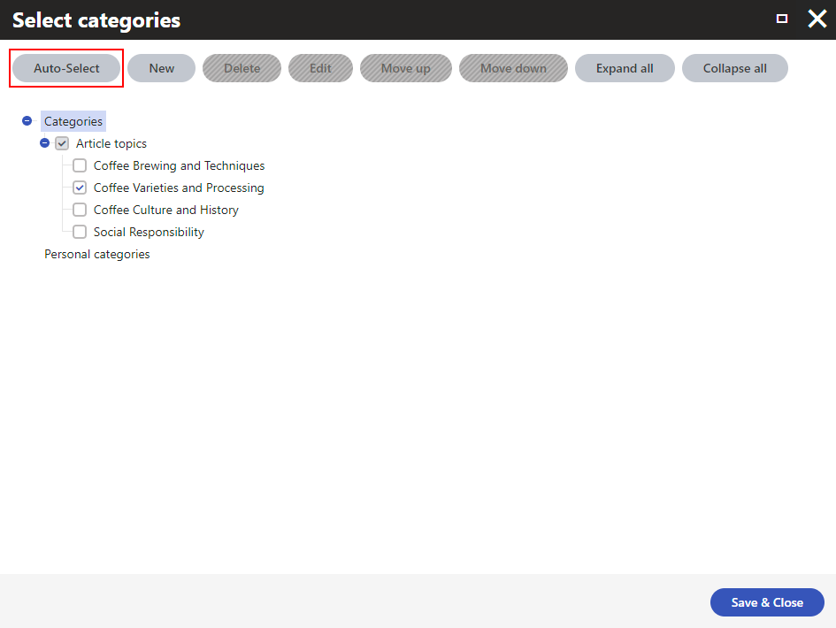

# Xperience Azure OpenAI integration

This custom module allows Xperience users to [automatically select](https://docs.kentico.com/x/IgqRBg) the best fitting categories for a page based on its content using [Azure OpenAI](https://azure.microsoft.com/en-us/products/ai-services/openai-service).

## Installation

1. Install the [Kentico.Xperience.OpenAI.Azure](https://www.nuget.org/packages/Kentico.Xperience.OpenAI.Azure) NuGet package in the administration project.
2. Log into your [Azure portal](https://portal.azure.com/).
3. Create and configure an [Azure OpenAI resource](https://learn.microsoft.com/en-us/azure/ai-services/openai/how-to/create-resource?pivots=web-portal).
4. [Deploy a model](https://learn.microsoft.com/en-us/azure/ai-services/openai/how-to/create-resource?pivots=web-portal#deploy-a-model)
5. In Xperience, go to **Settings -> Content -> Azure OpenAI** and configure the settings:
    - General:
        - **Azure OpenAI API endpoint:** – value of the **Endpoint** field from **Resource Management -> Keys and Endpoints** of your Azure OpenAI resource in Azure portal.
        - **Azure OpenAI API endpoint:** – value of either the **KEY 1** or **KEY 2** fields (both keys will work) from **Resource Management -> Keys and Endpoints** of your Azure OpenAI resource in Azure portal.
    - Content categorization:
        - Select the **Enable content categorization** option.
        - **Deployment name** – the **Deployment name** you chose when deploying the model. Can be also found in **Azure OpenAI Studio -> Management -> Deployments**.

## Automatic selection of categories

After you [set up](#installation) the integration, next time you will be assigning a page into categories you can simply click the **Auto-Select** button and the best fitting categories based on the page's content will be automatically selected.

**Important notes:**
- The automatic selection overwrites your previously selected categories.
- The page you are assigning into categories must have at least some data stored in fields with **Text** or **LongText** data types. That is, the automatic selection doesn't work for pages that are built entirely via Page builder.

## Contributing

To see the guidelines for Contributing to Kentico open source software, please see [Kentico's `CONTRIBUTING.md`](https://github.com/Kentico/.github/blob/main/CONTRIBUTING.md) for more information and follow the [Kentico's `CODE_OF_CONDUCT`](https://github.com/Kentico/.github/blob/main/CODE_OF_CONDUCT.md).

Instructions and technical details for contributing to **this** project can be found in [Contributing Setup](./docs/Contributing-Setup.md).

## License

Distributed under the MIT License. See [`LICENSE.md`](./LICENSE.md) for more information.

## Support

See [`SUPPORT.md`](https://github.com/Kentico/.github/blob/main/SUPPORT.md#full-support) for more information.

For any security issues see [`SECURITY.md`](https://github.com/Kentico/.github/blob/main/SECURITY.md).
